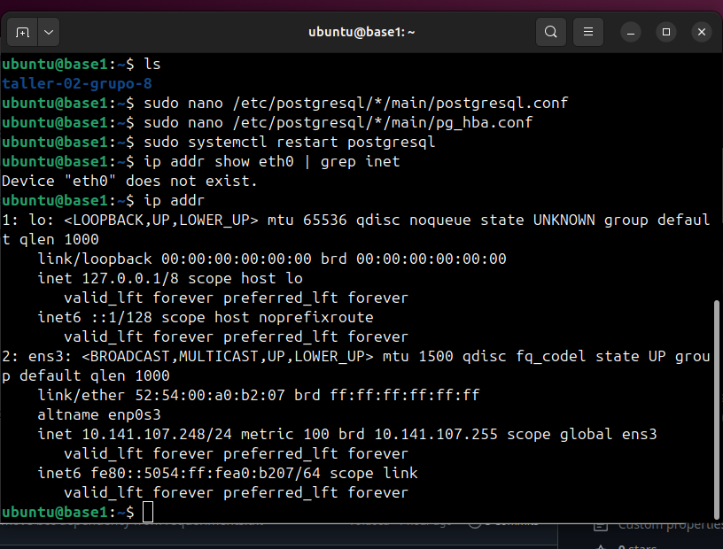
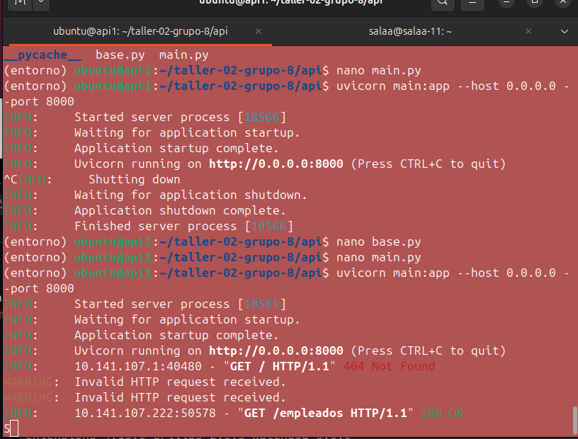
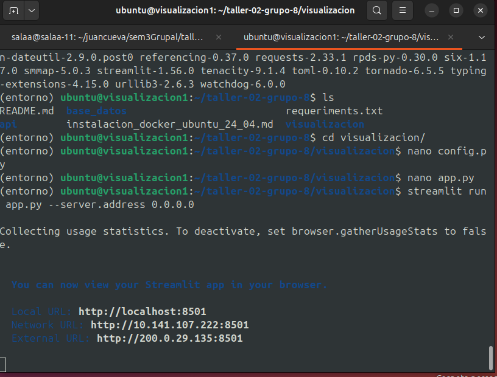
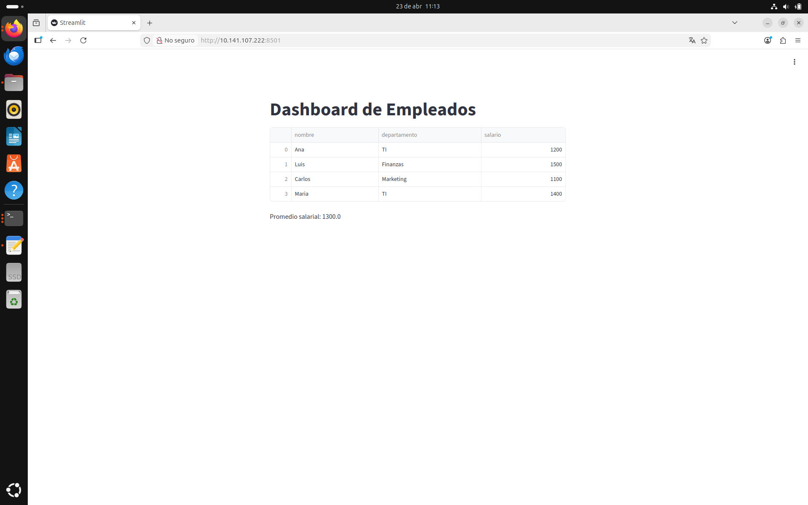

Documentación de Taller: IaaS Local con Multipass
1. Descripción del Proyecto

Este proyecto consiste en el despliegue de un sistema distribuido utilizando Infraestructura como Servicio (IaaS) de manera local. Se han configurado tres máquinas virtuales independientes para separar las capas de datos, lógica y presentación, garantizando un entorno escalable y organizado.

2. Tecnologías Utilizadas

    Multipass: Orquestación de máquinas virtuales (Ubuntu 24.04).

    PostgreSQL: Motor de base de datos relacional.

    FastAPI: Framework de alto rendimiento para la construcción de la API.

    Streamlit: Framework para la creación del dashboard interactivo.

    GitHub: Control de versiones y despliegue de código.

    Python: Lenguaje base para el backend y la visualización.

3. Arquitectura del Sistema

La comunicación se realiza a través de una red virtual interna proporcionada por Multipass:

    Capa de Datos (base1): Servidor PostgreSQL en el puerto 5432.

    Capa de Lógica (api1): API FastAPI en el puerto 8000.

    Capa de Presentación (visualizacion1): Dashboard Streamlit en el puerto 8501.

4. Evidencias de Funcionamiento de las multiples entornos virtuales

A. Base de Datos (base1)

B. Api (Api1)

C. Visualizacion (visualizacion)

5. Evidencias de Funcionamiento

6. Conclusión

El desarrollo permitió entender la importancia de la segmentación de servicios. A pesar de los retos técnicos como la gestión de IPs dinámicas y configuraciones de red en PostgreSQL, se logró un flujo de datos continuo desde la persistencia hasta la interfaz de usuario.
